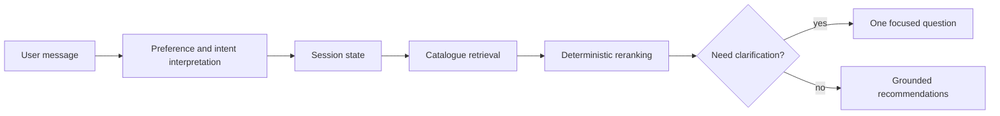

# FacetFlow — deterministic conversational shopping

FacetFlow is a fully offline, stateful shopping copilot that turns a changing conversation into grounded catalogue recommendations.

It is the TikTok TechJam 2026 Track 4 submission candidate. The shipped system has no API key, network dependency, model download, vector database, or generative model.

## The problem

Ordinary keyword search loses context when a shopper adds a must-have, excludes a material, or corrects an earlier requirement. A useful shopping copilot must preserve the right state across turns without inventing products or treating every broad request as a purchase decision.

## The solution

FacetFlow keeps conversational understanding, preference state, shopping intent, retrieval, ranking, and clarification as specialised deterministic components. It remembers explicit preferences, applies corrections and exclusions, distinguishes browsing from active buying, and only asks one focused question when it can improve a broad search.



Catalogue retrieval and ranking remain deterministic and only return IDs from the frozen catalogue. See [the architecture](docs/architecture.md) for the component boundaries.

## Quick start

FacetFlow needs Python 3.10–3.14, SQLite FTS5, and the official 50,000-product catalogue. It has no runtime third-party dependencies.

1. Download `catalog.jsonl.gz` and `SHA256SUMS` from the challenge release.
2. Verify and unpack the catalogue:

   ```bash
   sha256sum -c SHA256SUMS
   gzip -dk catalog.jsonl.gz
   mv catalog.jsonl data/catalog.jsonl
   ```

3. Run the real offline demo:

   ```bash
   make demo
   ```

The first run builds an ignored SQLite/FTS cache beside the project; later runs reuse it. `make demo` uses the real production agent, explains the current state, and makes no network request. If the catalogue is missing, the demo exits with a download-path error. For a four-scenario recording run, use:

```bash
FacetFlow_USE_OPENAI=0 FacetFlow_SPARSE_ONLY=1 \
  python3 -m FacetFlow.demo --scenario all --explain --format terminal \
  --catalog data/catalog.jsonl --cache-dir .FacetFlow_cache
```

See the step-by-step [judge quick start](docs/submission/judge_quickstart.md) for clean-machine setup and troubleshooting.

## What the demo shows

- Preference memory across turns
- Correction and override of a stale requirement
- Exclusion safety for a forbidden material
- A useful clarification for a genuinely broad browsing request

The terminal view shows the current interpreted state, shopping intent, exclusions, clarification reason, and real returned catalogue IDs. It never adds explainability fields to the official `Agent.respond` contract.

## Public evaluator results

These are public evaluator results, not hidden-test results. Hidden-test performance is unknown, and public-data optimisation does not prove generalisation. Three final runs were byte-identical.

| Metric | Starter baseline | FacetFlow | Absolute change | Multiplicative change |
| --- | ---: | ---: | ---: | ---: |
| TechnicalScore | 0.106710 | 0.458587 | +0.351877 | 4.297507× |
| HitRate@10 | 0.125000 | 0.530000 | +0.405000 | 4.240000× |
| MRR | 0.068034 | 0.325290 | +0.257256 | 4.781286× |
| Browsing HitRate@10 | 0.025000 | 0.575000 | +0.550000 | 23.000000× |

The canonical evidence, exact outputs, and fingerprint `92036d…91ff9` are in [the final submission evidence](reports/final_submission_evidence.md) and [the detailed public evaluation](reports/final_evaluation.md).

## Why deterministic components

FacetFlow uses structured dialogue state, catalogue-aware parsing, sparse retrieval, field weighting, deterministic reranking, and a turn-aware clarification policy together. It does not present internal modules as autonomous agents. This separation keeps product truth grounded in the frozen catalogue and makes repeated runs reproducible.

M2 tested three bounded reranking hypotheses on a locked shadow suite; none justified replacing the production reranker. We also evaluated a model-primary language interpreter through 120 live provider invocations. Although it improved selected development categories, its interpretations were not stable enough for promotion: development stability was 10% across all three repetitions and 23.33% pairwise, with holdout intentionally untouched. The submitted system therefore remains deterministic and offline.

## Repository map

| Path | Purpose |
| --- | --- |
| `starter/agent.py` | Official `Agent` entry point |
| `FacetFlow/` | Deterministic dialogue, retrieval, ranking, policy, and demo code |
| `evaluator/` | Local public evaluator |
| `data/` | Public sessions and catalogue acquisition notes |
| `reports/` | Reproducible public evaluation and submission evidence |
| `docs/submission/` | Judge quick start, Devpost draft, video package, and release checklist |

## Reproduce and test

```bash
make test-warnings
make index
make evaluate
python3 -m FacetFlow.demo --scenario all --explain --format terminal
```

`make evaluate` writes a public evaluator replay with zero reported model tokens. For the complete clean-machine workflow, see [reproducibility.md](docs/reproducibility.md). The release checklist separates automated checks from actions that require a human account or judgement.

## Limitations

FacetFlow is lexical-first and operates only on the frozen competition catalogue. Boundary sessions can be underdetermined, and it does not provide cross-store search, live pricing, checkout, customer service, external browsing, or claims about private-evaluator performance. Performance timing is host-dependent; the recorded profiling results are evidence, not a universal latency guarantee.

## Data, contributions, and submission materials

The catalogue derives from Amazon Reviews 2023; see [DATA_ATTRIBUTION.md](DATA_ATTRIBUTION.md). Team contributions require final confirmation and are intentionally left as concise placeholders in [the Devpost draft](docs/submission/devpost.md). The complete recording package and manual handoff are in [docs/submission](docs/submission/).
